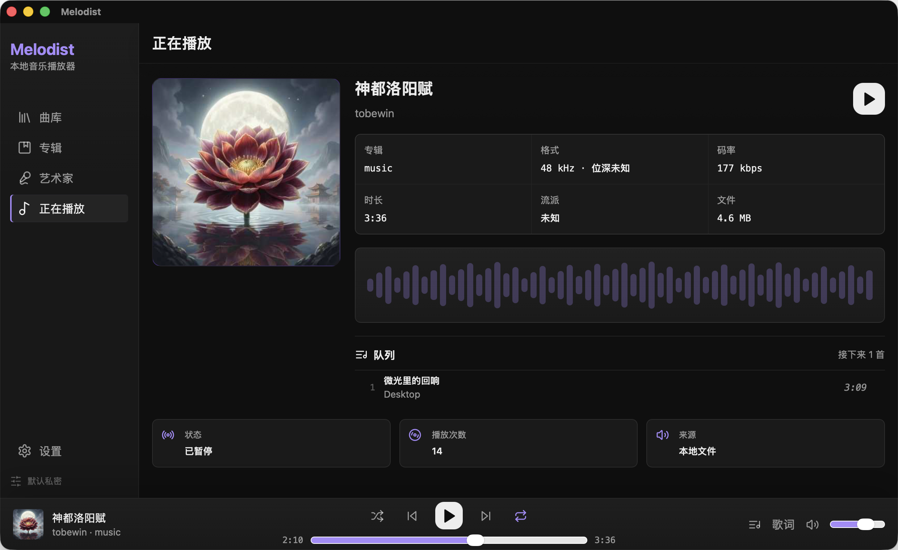

# Melodist

Melodist is a local-first, privacy-first desktop music player built with Rust,
Tauri 2, React 18, TypeScript, and Tailwind CSS v4.

The project is focused on a fast, private, cross-platform local music experience:
library management, resilient playback, synchronized lyrics, queue control, and
metadata, all stored on the user's device. Melodist does not include telemetry,
analytics, or crash reporting.

## Preview



## Current Status

This repository is in the late v0.1 beta / release-candidate track. The current
implementation includes:

- Tauri 2 application shell with Rust backend wiring
- React desktop app shell with Tailwind CSS v4 styling
- Local library scanning into SQLite with search, album, artist, and track views
- Drag-and-drop import for audio files, music folders, and same-name `.lrc` files
- Playback controls: play, pause, seek, next, previous, mute, and volume
- Automatic next-track playback with queue state synchronization
- Play queue with add to queue, play next, drag sorting, move up/down, remove, clear, and clear played
- Shuffle, repeat, progress events, media-key shortcuts, and window-scoped keyboard shortcuts
- Audio output device selection and ReplayGain track gain support
- Embedded cover extraction into the OS app data directory
- Embedded lyrics, same-name `.lrc` sidecar loading, synchronized lyric highlighting, and lyric offset controls
- LRC save/edit support for local sidecar files
- Library directory background change polling after folders are added or restored from settings
- English and Simplified Chinese UI, defaulting to English
- Type-safe Tauri IPC wrappers in `src/lib/tauri.ts`
- Zustand stores for frontend state
- Rust and Vitest coverage for parsing, metadata, queue behavior, shortcuts, lyrics, import diagnostics, and playback persistence

The macOS application bundle has been built and manually launched during
development. Release readiness still requires real-device verification on
Windows and Linux, especially audio output, drag-and-drop paths, packaging, and
installer flows.

## Feature Highlights

- **Local-first library**: scans local music into a SQLite database under the OS
  app data directory.
- **Private by default**: no telemetry, analytics, or always-on network calls.
- **Cross-platform target**: macOS 12+, Windows 10+, and Linux with glibc 2.31+.
- **Queue-first playback**: double-click tracks to build a queue from the
  current view, then reorder or clean it while listening.
- **Lyrics workflow**: reads embedded lyrics and `.lrc` sidecars, supports
  drag-imported LRC files, and keeps the active lyric centered during playback.
- **Responsive desktop UI**: compact dark interface with albums, artists, queue,
  now playing, lyrics, and settings panels.

## Supported Audio Formats

Melodist scans and plays the local formats supported by the current backend:

`mp3`, `flac`, `m4a`, `aac`, `ogg`, `opus`, `wav`, `aiff`, `ape`, and `wv`.

## Privacy Model

- Music processing is local-first and should run on-device by default.
- The app must not add telemetry, analytics, or always-on network behavior.
- User data belongs in the OS app data directory, not in the repository.
- Network-backed AI features are outside v0.1 and must remain opt-in when introduced.

## Requirements

- Node.js 20, as pinned by `.node-version`
- pnpm 10.13.1, as pinned by `packageManager`
- Stable Rust toolchain
- Platform dependencies required by Tauri 2

On Linux, install the WebKitGTK and related system packages required by Tauri before building.
For Ubuntu 22.04, the CI baseline uses:

```bash
sudo apt install libwebkit2gtk-4.1-dev libssl-dev libasound2-dev libayatana-appindicator3-dev librsvg2-dev patchelf
```

On Windows, the current NSIS installer uses the WebView2 download bootstrapper.
Normal app playback and library browsing remain local-first; installer-time
WebView2 setup may require network access on machines without the runtime.

## Development

```bash
pnpm install
pnpm tauri dev
```

Useful package scripts:

```bash
pnpm build
pnpm preview
pnpm typecheck
pnpm test
pnpm lint
```

Rust-side commands are run from `src-tauri`:

```bash
cd src-tauri
cargo fmt --check
cargo clippy -- -D warnings
cargo test
```

## Release Verification

Before declaring a v0.1 build ready, run the automated checks that are relevant to the branch:

```bash
pnpm typecheck
pnpm lint
pnpm test
pnpm smoke:library
pnpm smoke:verify-library
pnpm build
(cd src-tauri && cargo fmt --check)
(cd src-tauri && cargo clippy -- -D warnings)
(cd src-tauri && cargo test)
pnpm tauri build --debug
pnpm release:collect-assets
```

Then complete the manual release checklist in `docs/release-checklist.md` with real local audio files on macOS, Windows, and Linux.

The current local validation baseline includes:

- Frontend: `pnpm typecheck`, `pnpm lint`, `pnpm test`, `pnpm build`
- Rust: `cargo fmt --check`, `cargo clippy -- -D warnings`, `cargo test`
- macOS bundle: `pnpm tauri build --ci --bundles app`

## v0.1 Scope

Expected v0.1 release readiness centers on:

- Local music library scan and browsing
- Playback controls: play, pause, seek, next, previous, volume
- Play queue with shuffle, repeat, sorting, cleanup, and persistence
- Track list search
- Album and artist views
- Embedded cover art display and cache
- Embedded lyrics, LRC sidecar display, and LRC sidecar save/import
- Settings for library directories, audio output, and volume normalization
- Keyboard shortcuts
- CI-backed builds for macOS, Windows, and Linux

## Out Of Scope For v0.1

These are intentionally deferred to v0.2 or later:

- Whisper-based AI lyrics generation
- Lyrics translation
- Network translation provider settings beyond placeholders
- Playlist management beyond the play queue
- Last.fm scrobbling
- Equalizer
- MusicBrainz metadata enrichment

## Repository

GitHub: <https://github.com/ToBeWin/Melodist>

See `AGENTS.md` for the authoritative architecture and coding rules.

## License

MIT. See `LICENSE`.
